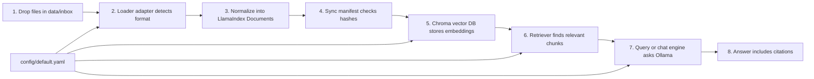

# COBOL RAG Pipeline

Flexible local RAG pipeline for COBOL analysis artifacts. The first target is a safe, repeatable workflow for testing generated analysis outputs, then querying them with a LlamaIndex-based CLI and chat interface.

## Pipeline Diagram



## What Each Step Does

### 1. Drop Files In `data/inbox`

Put new analysis outputs in `data/inbox/`. They can be folders from `cobol-rekt`, JSON files from another tool, Markdown notes, plain text, COBOL files, or copybooks once the matching loader exists.

Future adjustment point: add a new subfolder convention if we need to separate datasets by person, experiment, or date.

### 2. Loader Adapter Detects Format

A loader adapter decides whether it can read a file or folder. For now, the project has general adapters for JSON and plain text-like files. Specific adapters, such as a dedicated `cobol-rekt` chunk loader, should be added later when the generic flow is stable.

Future adjustment point: add one new loader file in `src/cobol_rag/loaders/` instead of changing the rest of the pipeline.

### 3. Normalize Into LlamaIndex Documents

Every loader returns the same kind of object: a LlamaIndex `Document` with text and metadata. This is the main contract that keeps the pipeline flexible.

Required metadata should include stable identifiers such as `source_id`, `source_path`, `source_format`, and `content_hash`. COBOL-specific metadata like `program`, `chunk_id`, and `chunk_type` should be included when available.

Future adjustment point: extend metadata carefully, but keep existing field names stable so removal, filtering, and evaluation keep working.

### 4. Sync Manifest Checks Hashes

The sync step compares the current files with a local manifest in `data/manifests/`. New files are inserted, changed files are refreshed, and unchanged files are skipped.

Future adjustment point: if sync behavior gets risky, add `--dry-run` output first and only then apply changes.

### 5. Chroma Stores Embeddings

LlamaIndex sends document text to the configured embedding model and stores the resulting vectors in ChromaDB under `.chroma/`.

Current default embedding model:

```yaml
embedding:
  model: "mxbai-embed-large:latest"
```

Future adjustment point: change the embedding model in `config/default.yaml`, then rebuild the affected collection because embeddings from different models should not be mixed casually.

### 6. Retriever Finds Relevant Chunks

For a question, the retriever searches Chroma and returns the most relevant chunks. Retrieval is tested separately before trusting generated answers.

Future adjustment point: tune `retrieval.top_k`, add metadata filters, then later add hybrid search or reranking.

### 7. Query Or Chat Engine Asks Ollama

LlamaIndex passes the retrieved context to the configured local LLM. One-shot query comes first, then terminal chat, then possibly a web UI.

Current default LLM:

```yaml
llm:
  model: "granite-code:8b"
```

Future adjustment point: change `llm.model` in config or override it with `COBOL_RAG_LLM_MODEL`.

### 8. Answer Includes Citations

Every useful answer must cite the source IDs or chunk IDs that supported it. If an answer has no citation, treat it as not trustworthy.

Future adjustment point: tighten the answer prompt and evaluation checks whenever citations are missing or vague.

## Current Setup

Create and use the virtual environment:

```bash
python3 -m venv .venv
source .venv/bin/activate
python -m pip install --upgrade pip
```

Install dependencies:

```bash
pip install \
  llama-index \
  llama-index-vector-stores-chroma \
  llama-index-llms-ollama \
  llama-index-embeddings-ollama \
  chromadb \
  typer \
  rich \
  pydantic-settings \
  pyyaml
```

Print the active config:

```bash
cobol-rag config
```

Open the configured LlamaIndex/Chroma index without ingesting data:

```bash
cobol-rag index-info
```

This creates `.chroma/` if needed, opens the configured collection, and prints the current LLM, embedding model, and document count.

Inspect a file or folder without indexing it:

```bash
cobol-rag inspect data/inbox/example.json
cobol-rag inspect data/inbox/example.txt
```

The current loaders are intentionally general:

- `generic_json` handles JSON objects or lists. It extracts text from configured fields such as `text`, `content`, `summary`, or `description`; if none are present, it stores the stable JSON representation as text.
- `plain_text` handles UTF-8 text-like files such as `.txt`, `.md`, `.cbl`, `.cpy`, `.cob`, and `.jcl`.

Format-specific loaders, including `cobol-rekt` chunks or friend-specific output formats, should be added later as small adapters after we have real examples.

During early development, before installing the package as editable, use:

```bash
PYTHONPATH=src .venv/bin/python -m cobol_rag.cli config
```

## Small Safe Development Rule

Each implementation step should be small enough to verify with one command.

Preferred pattern:

1. Update or add the smallest code slice.
2. Update this README if the pipeline behavior changes.
3. Update `PLAN.md` if the sequence or safety rule changes.
4. Run the narrowest useful verification command.
5. Only then move to the next slice.
