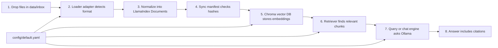

# COBOL RAG Pipeline

Flexible local RAG pipeline for COBOL analysis artifacts. The first target is a safe, repeatable workflow for testing generated analysis outputs, then querying them with a LlamaIndex-based CLI and chat interface.

## Pipeline Diagram



## What Each Step Does

### 1. Drop Files In `data/inbox`

Put new analysis outputs in `data/inbox/`. They can be folders from `cobol-rekt`, JSON files from another tool, Markdown notes, plain text, COBOL files, or copybooks once the matching loader exists.

Future adjustment point: add a new subfolder convention if we need to separate datasets by person, experiment, or date.

### 2. Loader Adapter Detects Format

A loader adapter decides whether it can read a file or folder. For now, the project has general adapters for JSON and plain text-like files. Specific adapters, such as a dedicated `cobol-rekt` chunk loader, should be added later when the generic flow is stable.

Future adjustment point: add one new loader file in `src/cobol_rag/loaders/` instead of changing the rest of the pipeline.

### 3. Normalize Into LlamaIndex Documents

Every loader returns the same kind of object: a LlamaIndex `Document` with text and metadata. This is the main contract that keeps the pipeline flexible.

Required metadata should include stable identifiers such as `source_id`, `source_path`, `source_format`, and `content_hash`. COBOL-specific metadata like `program`, `chunk_id`, and `chunk_type` should be included when available.

Future adjustment point: extend metadata carefully, but keep existing field names stable so removal, filtering, and evaluation keep working.

### 4. Sync Manifest Checks Hashes

The sync step compares the current files with a local manifest in `data/manifests/`. New files are inserted, changed files are refreshed, and unchanged files are skipped.

Future adjustment point: if sync behavior gets risky, add `--dry-run` output first and only then apply changes.

### 5. Chroma Stores Embeddings

LlamaIndex sends document text to the configured embedding model and stores the resulting vectors in ChromaDB under `.chroma/`.

Current default embedding model:

```yaml
embedding:
  model: "mxbai-embed-large:latest"
```

Future adjustment point: change the embedding model in `config/default.yaml`, then rebuild the affected collection because embeddings from different models should not be mixed casually.

### 6. Retriever Finds Relevant Chunks

For a question, the retriever searches Chroma and returns the most relevant chunks. Retrieval is tested separately before trusting generated answers.

Future adjustment point: tune `retrieval.top_k`, add metadata filters, then later add hybrid search or reranking.

### 7. Query Or Chat Engine Asks Ollama

LlamaIndex passes the retrieved context to the configured local LLM. One-shot query comes first, then terminal chat, then possibly a web UI.

Current default LLM:

```yaml
llm:
  model: "granite-code:8b-instruct"
```

Future adjustment point: change `llm.model` in config or override it with `COBOL_RAG_LLM_MODEL`.

### 8. Answer Includes Citations

Every useful answer must cite the source IDs or chunk IDs that supported it. If an answer has no citation, treat it as not trustworthy.

Future adjustment point: tighten the answer prompt and evaluation checks whenever citations are missing or vague.

## Current Setup

Create and use the virtual environment:

```bash
python3 -m venv .venv
source .venv/bin/activate
python -m pip install --upgrade pip
```

Install dependencies:

```bash
pip install \
  llama-index \
  llama-index-vector-stores-chroma \
  llama-index-llms-ollama \
  llama-index-embeddings-ollama \
  chromadb \
  typer \
  rich \
  pydantic-settings \
  pyyaml
```

Print the active config:

```bash
cobol-rag config
```

Open the configured LlamaIndex/Chroma index without ingesting data:

```bash
cobol-rag index-info
```

This creates `.chroma/` if needed, opens the configured collection, and prints the current LLM, embedding model, and document count.

Inspect a file or folder without indexing it:

```bash
cobol-rag inspect data/inbox/example.json
cobol-rag inspect data/inbox/example.txt
```

The current loaders are intentionally general:

- `generic_json` handles JSON objects or lists. It extracts text from configured fields such as `text`, `content`, `summary`, or `description`; if none are present, it stores the stable JSON representation as text.
- `plain_text` handles UTF-8 text-like files such as `.txt`, `.md`, `.cbl`, `.cpy`, `.cob`, and `.jcl`.

Format-specific loaders, including `cobol-rekt` chunks or friend-specific output formats, should be added later as small adapters after we have real examples.

Plan an inbox sync without writing to Chroma:

```bash
cobol-rag sync --dry-run
```

`sync --dry-run` scans `data/inbox/`, loads supported files with the general loader registry, computes each document `content_hash`, reads the collection manifest from `data/manifests/<collection>.json` if it exists, and prints what would be added, updated, or skipped.

Safety rule: `sync --dry-run` does not write to Chroma and does not write the manifest. `sync --apply` is the explicit write command.

## Sync Workflow

The intended day-to-day workflow is:

```bash
cp /path/to/output.json data/inbox/
cobol-rag inspect data/inbox/output.json
cobol-rag sync --dry-run
cobol-rag sync --apply
cobol-rag sync --dry-run
```

Read the sync output before applying future indexing behavior:

- `would_add`: the document is not present in the manifest yet.
- `would_update`: the same `source_id` exists, but its `content_hash` changed.
- `would_skip`: the same `source_id` and `content_hash` already exist in the manifest.
- `indexing: no`: no vector database write happened.
- `manifest_write: no`: no manifest update happened.
- `indexing: yes`: `sync --apply` wrote add/update documents to Chroma.
- `manifest_write: yes`: `sync --apply` wrote the manifest after successful indexing.

Manifest files will live in `data/manifests/` and are keyed by collection name. For example, the default collection will use:

```text
data/manifests/cobol-dev.json
```

`sync --apply` writes in this order:

1. Open the configured Chroma collection.
2. For each `add` or `update`, delete existing Chroma records with the same `source_id`.
3. Insert the fresh LlamaIndex `Document`.
4. Write `data/manifests/<collection>.json`.

Future adjustment point: keep `--dry-run` as the default safe preview. Any destructive behavior, such as removing documents no longer present in `data/inbox/`, should get its own dry-run output before writes are allowed.

## Remove Workflow

Removal also follows the dry-run/apply rule.

Preview removal by source path:

```bash
cobol-rag remove --source-path data/inbox/example.txt --dry-run
```

Apply removal:

```bash
cobol-rag remove --source-path data/inbox/example.txt --apply
```

You can also remove a single normalized document by `source_id`:

```bash
cobol-rag remove --source-id plain_text:data/inbox/example.txt --dry-run
```

Current removal support is intentionally general:

- `--source-id` removes exactly one normalized source id.
- `--source-path` removes every manifest entry that came from that path.
- `--dry-run` only reads the manifest and prints matching entries.
- `--apply` deletes matching Chroma records by `source_id`, then rewrites the manifest.

Fields such as `program`, `chunk_type`, or tool-specific identifiers will be added to removal later, after format-specific loaders add those metadata fields.

## Reset Workflow

Reset is the collection-level cleanup command. It does not delete `data/inbox/`; it only resets the configured Chroma collection and removes that collection's manifest.

Preview reset:

```bash
cobol-rag reset --dry-run
```

Apply reset:

```bash
cobol-rag reset --apply
```

After reset:

```bash
cobol-rag index-info
cobol-rag sync --dry-run
```

Expected result:

- `index-info` shows `documents: 0`.
- `sync --dry-run` sees the files still in `data/inbox/` and reports them as `would_add`.

Use reset when changing embedding models, clearing experiments, or rebuilding a collection from scratch.

## Final Scripts Enrichment Workflow

The detailed `final_scripts/` bundle is the evidence source for questions that
need deterministic analysis instead of a generic LLM guess. Some useful
question classes are not always present as first-class artifacts in the bundle,
so the pipeline can derive normalized review artifacts from the existing JSON
files.

Preview the derived artifacts:

```bash
cobol-rag enrich-final-scripts --root /path/to/final_scripts --program PDCBVC --dry-run
```

Write them back into the bundle:

```bash
cobol-rag enrich-final-scripts --root /path/to/final_scripts --program PDCBVC --apply
```

If the bundle is outside the repository, set the environment variable once:

```bash
export COBOL_RAG_FINAL_SCRIPTS_DIR="/path/to/final_scripts"
cobol-rag enrich-final-scripts --program PDCBVC --dry-run
```

On Windows PowerShell:

```powershell
$env:COBOL_RAG_FINAL_SCRIPTS_DIR="C:\path\to\final_scripts"
cobol-rag enrich-final-scripts --program PDCBVC --dry-run
```

Current derived artifact types:

- `quality.dead_code`: separates commented-out code from CFG reachability.
- `architecture.unused_copybooks`: compares COPY members with available
  variable/call evidence and reports proof level, so the assistant does not
  overclaim unused copybooks.
- `jcl.file_io`: maps JCL jobs, steps, DD reads, writes, and SYSOUT evidence to
  matching batch programs when the JCL artifacts contain that linkage.
- `screen_field_lineage`: groups BMS/map variables by screen field family and
  cites read, write, control-flow, literal/attribute, and connected-variable
  evidence.

These artifacts are also built in memory by direct-answer code when possible,
so the UI can answer common review questions even before `--apply` is run.
Writing them is still useful because it makes the evidence explicit and easier
to inspect, sync, and evaluate.

Direct structured answers include an `Evidence:` section or inline citations
such as `dataflow.variable/dataflow.variable.SCELTAI.json | line 317`, so a
good answer is traceable back to the generated artifact and COBOL/JCL line
where that line number is available.

## Retrieval Debug Workflow

Retrieval debug checks what evidence the vector database returns before any LLM answer is generated.

```bash
cobol-rag retrieve "General JSON document"
cobol-rag retrieve "plain text document" --top-k 3
```

The output shows:

- `score`: similarity score from retrieval.
- `source_format`: which loader produced the document.
- `source_id`: stable id used for sync/remove.
- `source_path`: original file path.
- `preview`: text that would be passed as evidence to a future query/chat step.

This command does not call the answer model and does not produce a final response. Use it to debug whether Chroma is finding the right sources before adding answer generation.

## One-Shot Query Workflow

One-shot query retrieves evidence, sends that evidence to the local LLM, and prints an answer with sources.

```bash
cobol-rag query "What is in the plain text document?"
cobol-rag query "What is in the JSON document?" --top-k 2
```

The answer is generated from retrieved context only. The CLI always prints a `Sources` table after the answer so you can check which indexed documents supported it.

If retrieval works but `query` fails, check the configured local LLM. The default config pins `context_window: 4096` for `granite-code:8b-instruct`, matching the normal Ollama CLI context size and avoiding oversized API context requests.

Current answer shape:

```text
Answer:
...

Sources:
- source_id
- source_path
```

Trust rule: an answer without sources is not useful for this project. If retrieval returns weak or wrong sources, debug with `cobol-rag retrieve ...` before trusting `cobol-rag query ...`.

## Chat Workflow

Terminal chat keeps a short conversation memory so follow-up questions can refer to earlier turns.

```bash
cobol-rag chat
cobol-rag chat --collection cobol-dev --top-k 3
```

For one non-interactive chat turn:

```bash
cobol-rag chat --once "What is in the plain text document?"
```

Chat commands:

- `/sources`: show sources from the last answer.
- `/reset`: clear chat memory.
- `/exit`: quit the chat loop.

Chat memory is not indexed evidence. It is only used to understand follow-up wording. Answers still have to come from retrieved Chroma sources, and each answer prints a `Sources` table.

During early development, before installing the package as editable, use:

```bash
PYTHONPATH=src .venv/bin/python -m cobol_rag.cli config
```

## Small Safe Development Rule

Each implementation step should be small enough to verify with one command.

Preferred pattern:

1. Update or add the smallest code slice.
2. Update this README if the pipeline behavior changes.
3. Update `PLAN.md` if the sequence or safety rule changes.
4. Run the narrowest useful verification command.
5. Only then move to the next slice.
