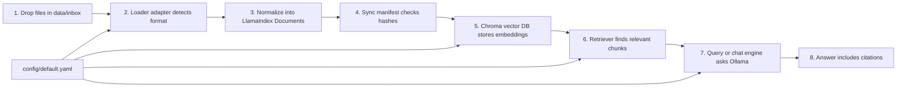

# COBOL RAG Pipeline

Flexible local RAG pipeline for COBOL analysis artifacts. The first target is a safe, repeatable workflow for testing generated analysis outputs, then querying them with a LlamaIndex-based CLI and chat interface.

## Pipeline Diagram


```mermaid
flowchart LR
    A["1. Drop files in data/inbox"] --> B["2. Loader adapter detects format"]
    B --> C["3. Normalize into LlamaIndex Documents"]
    C --> D["4. Sync manifest checks hashes"]
    D --> E["5. Chroma vector DB stores embeddings"]
    E --> F["6. Retriever finds relevant chunks"]
    F --> G["7. Query or chat engine asks Ollama"]
    G --> H["8. Answer includes citations"]

    I["config/default.yaml"] --> B
    I --> E
    I --> F
    I --> G
```

## What Each Step Does

### 1. Drop Files In `data/inbox`

Put new analysis outputs in `data/inbox/`. They can be folders from `cobol-rekt`, JSON files from another tool, Markdown notes, plain text, COBOL files, or copybooks once the matching loader exists.

Future adjustment point: add a new subfolder convention if we need to separate datasets by person, experiment, or date.

### 2. Loader Adapter Detects Format

A loader adapter decides whether it can read a file or folder. For now, the project has general adapters for JSON and plain text-like files. Specific adapters, such as a dedicated `cobol-rekt` chunk loader, should be added later when the generic flow is stable.

Future adjustment point: add one new loader file in `src/cobol_rag/loaders/` instead of changing the rest of the pipeline.

### 3. Normalize Into LlamaIndex Documents

Every loader returns the same kind of object: a LlamaIndex `Document` with text and metadata. This is the main contract that keeps the pipeline flexible.

Required metadata should include stable identifiers such as `source_id`, `source_path`, `source_format`, and `content_hash`. COBOL-specific metadata like `program`, `chunk_id`, and `chunk_type` should be included when available.

Future adjustment point: extend metadata carefully, but keep existing field names stable so removal, filtering, and evaluation keep working.

### 4. Sync Manifest Checks Hashes

The sync step compares the current files with a local manifest in `data/manifests/`. New files are inserted, changed files are refreshed, and unchanged files are skipped.

Future adjustment point: if sync behavior gets risky, add `--dry-run` output first and only then apply changes.

### 5. Chroma Stores Embeddings

LlamaIndex sends document text to the configured embedding model and stores the resulting vectors in ChromaDB under `.chroma/`.

Current default embedding model:

```yaml
embedding:
  model: "mxbai-embed-large:latest"
```

Future adjustment point: change the embedding model in `config/default.yaml`, then rebuild the affected collection because embeddings from different models should not be mixed casually.

### 6. Retriever Finds Relevant Chunks

For a question, the retriever searches Chroma and returns the most relevant chunks. Retrieval is tested separately before trusting generated answers.

Future adjustment point: tune `retrieval.top_k`, add metadata filters, then later add hybrid search or reranking.

### 7. Query Or Chat Engine Asks Ollama

LlamaIndex passes the retrieved context to the configured local LLM. One-shot query comes first, then terminal chat, then possibly a web UI.

Current default LLM:

```yaml
llm:
  model: "granite-code:8b-instruct"
```

Future adjustment point: change `llm.model` in config or override it with `COBOL_RAG_LLM_MODEL`.

### 8. Answer Includes Citations

Every useful answer must cite the source IDs or chunk IDs that supported it. If an answer has no citation, treat it as not trustworthy.

Future adjustment point: tighten the answer prompt and evaluation checks whenever citations are missing or vague.

## Current Setup

Create and use the virtual environment:

```bash
python3 -m venv .venv
source .venv/bin/activate
python -m pip install --upgrade pip
```

Install dependencies:

```bash
pip install \
  llama-index \
  llama-index-vector-stores-chroma \
  llama-index-llms-ollama \
  llama-index-embeddings-ollama \
  chromadb \
  typer \
  rich \
  pydantic-settings \
  pyyaml
```

Print the active config:

```bash
cobol-rag config
```

Open the configured LlamaIndex/Chroma index without ingesting data:

```bash
cobol-rag index-info
```

This creates `.chroma/` if needed, opens the configured collection, and prints the current LLM, embedding model, and document count.

Inspect a file or folder without indexing it:

```bash
cobol-rag inspect data/inbox/example.json
cobol-rag inspect data/inbox/example.txt
```

The current loaders are intentionally general:

- `rag_documents` handles the `rag_documents.jsonl` and `rag_documents.json` files produced by the `control_flow` RAG document factory. It keeps the factory text unchanged, uses the factory record `id` as the stable chunk id, and maps factory `type` into `chunk_type` for retrieval filters and intent reranking.
- `generic_json` handles JSON objects or lists. It extracts text from configured fields such as `text`, `content`, `summary`, or `description`; if none are present, it stores the stable JSON representation as text.
- `plain_text` handles UTF-8 text-like files such as `.txt`, `.md`, `.cbl`, `.cpy`, `.cob`, and `.jcl`.

Format-specific loaders should stay as small adapters around one source contract, so the rest of the sync/retrieval pipeline stays stable.

## Control Flow Factory Output

The preferred input from `control_flow` is the final RAG index folder created by `scripts/pipeline/run_rag_factory.py`, especially:

```text
rag_index/rag_documents.jsonl
rag_index/rag_manifest.json
rag_index/program_index.json
```

For Ollama `mxbai-embed-large`, keep factory chunks compact. A safe tested setting from `control_flow` is:

```bash
python scripts/pipeline/build_rag_index.py \
  --out-root /path/to/program_artifacts \
  --out-dir /path/to/rag_index_embed_safe \
  --max-text-chars 1200 \
  --overlap-chars 150
```

Inspect the JSONL before indexing:

```bash
cobol-rag inspect /path/to/rag_index/rag_documents.jsonl
cobol-rag inspect /path/to/rag_index
```

Sync it directly without copying into `data/inbox`. Passing the `rag_index` folder automatically selects `rag_documents.jsonl` when present:

```bash
cobol-rag sync /path/to/rag_index --dry-run
cobol-rag sync /path/to/rag_index --apply
```

The loader preserves factory metadata such as `program`, `source_file`, `source_kind`, `chunk_index`, and `chunk_count`. It also exposes the factory document type as `chunk_type`, so commands like this can target a specific evidence family:

```bash
cobol-rag retrieve "which copybooks are shared?" --chunk-type global.copybook_usage
```

Plan an inbox sync without writing to Chroma:

```bash
cobol-rag sync --dry-run
```

`sync --dry-run` scans `data/inbox/`, loads supported files with the general loader registry, computes each document `content_hash`, reads the collection manifest from `data/manifests/<collection>.json` if it exists, and prints what would be added, updated, or skipped.

Safety rule: `sync --dry-run` does not write to Chroma and does not write the manifest. `sync --apply` is the explicit write command.

## Sync Workflow

The intended day-to-day workflow is:

```bash
cp /path/to/output.json data/inbox/
cobol-rag inspect data/inbox/output.json
cobol-rag sync --dry-run
cobol-rag sync --apply
cobol-rag sync --dry-run
```

Read the sync output before applying future indexing behavior:

- `would_add`: the document is not present in the manifest yet.
- `would_update`: the same `source_id` exists, but its `content_hash` changed.
- `would_skip`: the same `source_id` and `content_hash` already exist in the manifest.
- `indexing: no`: no vector database write happened.
- `manifest_write: no`: no manifest update happened.
- `indexing: yes`: `sync --apply` wrote add/update documents to Chroma.
- `manifest_write: yes`: `sync --apply` wrote the manifest after successful indexing.

Manifest files will live in `data/manifests/` and are keyed by collection name. For example, the default collection will use:

```text
data/manifests/cobol-dev.json
```

`sync --apply` writes in this order:

1. Open the configured Chroma collection.
2. For each `add` or `update`, delete existing Chroma records with the same `source_id`.
3. Insert the fresh LlamaIndex `Document`.
4. Write `data/manifests/<collection>.json`.

Future adjustment point: keep `--dry-run` as the default safe preview. Any destructive behavior, such as removing documents no longer present in `data/inbox/`, should get its own dry-run output before writes are allowed.

## Remove Workflow

Removal also follows the dry-run/apply rule.

Preview removal by source path:

```bash
cobol-rag remove --source-path data/inbox/example.txt --dry-run
```

Apply removal:

```bash
cobol-rag remove --source-path data/inbox/example.txt --apply
```

You can also remove a single normalized document by `source_id`:

```bash
cobol-rag remove --source-id plain_text:data/inbox/example.txt --dry-run
```

Current removal support is intentionally general:

- `--source-id` removes exactly one normalized source id.
- `--source-path` removes every manifest entry that came from that path.
- `--dry-run` only reads the manifest and prints matching entries.
- `--apply` deletes matching Chroma records by `source_id`, then rewrites the manifest.

Fields such as `program`, `chunk_type`, or tool-specific identifiers will be added to removal later, after format-specific loaders add those metadata fields.

## Reset Workflow

Reset is the collection-level cleanup command. It does not delete `data/inbox/`; it only resets the configured Chroma collection and removes that collection's manifest.

Preview reset:

```bash
cobol-rag reset --dry-run
```

Apply reset:

```bash
cobol-rag reset --apply
```

After reset:

```bash
cobol-rag index-info
cobol-rag sync --dry-run
```

Expected result:

- `index-info` shows `documents: 0`.
- `sync --dry-run` sees the files still in `data/inbox/` and reports them as `would_add`.

Use reset when changing embedding models, clearing experiments, or rebuilding a collection from scratch.

## Retrieval Debug Workflow

Retrieval debug checks what evidence the vector database returns before any LLM answer is generated.

```bash
cobol-rag retrieve "General JSON document"
cobol-rag retrieve "plain text document" --top-k 3
```

The output shows:

- `score`: similarity score from retrieval.
- `source_format`: which loader produced the document.
- `source_id`: stable id used for sync/remove.
- `source_path`: original file path.
- `preview`: text that would be passed as evidence to a future query/chat step.

This command does not call the answer model and does not produce a final response. Use it to debug whether Chroma is finding the right sources before adding answer generation.

## One-Shot Query Workflow

One-shot query retrieves evidence, sends that evidence to the local LLM, and prints an answer with sources.

```bash
cobol-rag query "What is in the plain text document?"
cobol-rag query "What is in the JSON document?" --top-k 2
```

The answer is generated from retrieved context only. The CLI always prints a `Sources` table after the answer so you can check which indexed documents supported it.

If retrieval works but `query` fails, check the configured local LLM. The default config pins `context_window: 4096` for `granite-code:8b-instruct`, matching the normal Ollama CLI context size and avoiding oversized API context requests.

Current answer shape:

```text
Answer:
...

Sources:
- source_id
- source_path
```

Trust rule: a factual COBOL answer without sources is not useful for this project. Conversational and clarification replies intentionally have no sources. If retrieval returns weak or wrong sources, debug with `cobol-rag retrieve ...` before trusting `cobol-rag query ...`.

## Semantic Query Routing

Query handling uses a hybrid deterministic + LLM + semantic routing plan. The complete implementation and operating guide is in [docs/research-rag-implementation.md](docs/research-rag-implementation.md).

1. Resolve the program and all exact COBOL entities from the question. An explicitly named program wins; otherwise the current technical session or a uniquely owned entity may select it. A multi-program corpus without a unique target produces a clarification instead of defaulting to PDCBVC. Structured session state is inherited only for an explicit follow-up.
2. Compile authoritative scope and literal constraints: exact entities, operations/exclusions, division/section filters, requested fields, and condition terms.
3. Ask the configured LLM to produce the hierarchical semantic plan: route, category, domain, intent, tasks, relations, response language, and source families. Preserve explicit constraints during fusion and retry contradictory/invalid plans with a compact LLM prompt.
4. Decompose compound requests into independently verifiable semantic claims. Each claim receives one evidence capability, an exact entity subset, relations, required fields, and allowed source families. Literal assignments, call context, variable lineage, control flow, quality evidence, and other capabilities cannot silently borrow incompatible evidence.
5. Execute every claim independently. Use capability-gated structured executors first, including exact artifacts, paragraph references/body, CFG paths, call before/after context, DB2/JCL separation, copybook usage examples, quality categories, and pagination. Otherwise translate only that claim into program/entity/task metadata filters, run hybrid retrieval, and expand bounded parent/entity/domain context.
6. Validate each claim separately. Retry only unresolved claims through retrieval, grounded generation, and citation repair; successful claims are never regenerated. Compose verified claims and explicitly report any still-unresolved required claim. `all`, `every`, and `every single` set `result_scope=all`, so collection answers must return the source count completely rather than silently applying a top-N cap.

Exact multiple identifiers are preserved as a set. Direct artifact roots and returned sources are checked against the selected program so same-named artifacts from different programs cannot be mixed. A new explicit intent clears incompatible entity memory. Technical continuations such as `there is more`, `continue`, and `show the rest` retain the prior program and intent. Ambiguous identifier prefixes request the exact COBOL name instead of silently selecting a candidate. Qualifiers such as source line, division, section, `only`, exhaustive scope, excluded evidence types, condition values, and CICS operation types are plan fields rather than special-case answer strings.

The semantic router classifies meaning using the current message and recent technical questions. Technical intents include artifact inventory, variable inventory, variable dataflow, copybooks, business rules, external programs, control flow, CICS operations, static values, dead code, DB2/SQL, datasets, UI navigation, source metrics, program summary, and general COBOL analysis.

A semantic capability router sits underneath the LLM planner as its deterministic floor. Every evidence capability carries a natural-language description of what it answers in `src/cobol_rag/capability_router.py`; a question is embedded with the same model that indexes the corpus and ranked against those descriptions. When the planner returns an unusable plan, or returns `technical` with no intent and no task, the top-ranked capability supplies the missing one instead of the system degrading into generic retrieval with no handler. A match is used only when it clears both a similarity and a margin threshold, so a question that belongs to no capability stays unrouted rather than being forced into the nearest one. Deterministic entity scope still gates which capabilities are eligible: entity-scoped capabilities are dropped when no identifier was resolved, and a named variable removes the whole-program catalogue from the ranking so exact evidence always wins. Adding a capability means adding a description, never a question pattern; ranking accuracy is measurable independently of the planner.

Entity-scoped and program-wide questions use different evidence. `variable_dataflow` answers about one named variable from `dataflow.variable.<NAME>.json`; `variable_inventory` answers about a program's variables in general from the generated `dataflow.used_variables.json` catalogue. The router chooses between them by meaning rather than by wording, so listing, counting, sampling, and "which ones control flow" all reach the catalogue, while a named identifier still routes to its exact per-variable evidence. The catalogue is a direct-artifact capability, so these answers need no LLM generation.

The conversational route answers without retrieval or citation validation. A message whose deterministic scope resolved an analyzed program from the question itself, or any exact COBOL identifier, can therefore never be answered conversationally; such a turn is forced back to the technical path so the reply stays evidence-grounded. A program selected in the UI does not trigger this, so greetings remain conversational. Two further contracts close the same hole from the output side: a conversational reply that names an analyzed program or any COBOL identifier is treated as a technical answer that skipped validation, and an explicit continuation of a technical thread (`there is more`, `show the rest`) can never be answered conversationally. Naming the domain itself (COBOL, CICS, DB2) stays allowed, so capability descriptions still work.

A name the corpus does not contain is answered with an abstention rather than with whichever program happened to be selected. An identifier-shaped token that matches no analyzed program and no catalogued entity resolves to an explicit unresolved reference, so asking about an unanalyzed program, or comparing an analyzed program against one that was never indexed, says so instead of returning the selected program's evidence under the wrong name. This matters more as the corpus grows: most programs a user names will not be indexed yet.

Output-field contracts are checked against what the selected capability can render. Program-level capabilities such as the summary, metrics, artifact inventory, and variable catalogue describe a whole program rather than a location inside it, so they are never required to quote a source line; asking how big a program is "in terms of lines of code" is a size question and no longer sets the source-line requirement that once rejected a correct answer.

Generated claims may narrate verified evidence but may not introduce facts of their own. Counts and absence are properties of a complete artifact, while retrieval returns parts of one, so a generated sentence asserting `N somethings` or `has no X` is rejected regardless of how well its words match a chunk. Word-overlap support cannot distinguish a true statement from a false one built out of true words, which is how a prompt-injection message once produced a validated "has no variables" answer. Deterministic handlers read whole artifacts and render these totals themselves, and they do not pass through claim validation, so the honest count still reaches the user.

- `technical`: dispatch to the canonical evidence handler, then fall back to hybrid retrieval and grounded generation only when necessary.
- `conversational`: generate a short natural reply without vector retrieval or returned sources.
- `unclear`: request clarification and explain the COBOL-analysis scope without running retrieval.

The API returns `route`, `scope`, `plan`, `session_state`, `guard_status`, `trace_id`, `execution_mode`, `answer`, and `sources`. The UI labels direct-artifact, retrieved-renderer, grounded-LLM, repaired, clarification, and conversational answers. Only technical turns update structured program/entity/intent memory.

`POST /api/chat` also accepts an optional `program` field. This is the program selected by a future multi-program UI and is used when the question does not explicitly name another analyzed program:

```json
{"message": "List every forced value.", "program": "PDCBVC"}
```

## Traces, Feedback, And Gold Evaluation

Every answer in the configured API runtime writes a JSON trace containing the resolved scope, metadata filter, vector and lexical candidates, final context roles, corrective-retrieval decision, guard result, answer sources, and latency.

```text
GET  /api/traces
GET  /api/traces/{trace_id}
POST /api/feedback
GET  /api/feedback
```

Run the PDCBVC regression suite with:

```bash
python -m cobol_rag.evaluation \
  --config /workspace/.runs/PDCBVC/rag/config/runtime.yaml \
  --gold evals/pdcbvc_gold.jsonl \
  --final-scripts-dir /workspace/.runs/PDCBVC/analysis/output/combined/final_scripts/PDCBVC
```

Evaluation reports are written to the configured `paths.eval_dir`. The current 74-case development suite measures route, intent, program, entities, comparison and exhaustive-result plans, source recall, execution mode, answer content, follow-up behavior, abstention, typed keyword handling, and compound-contract reconciliation.

The development gold suite must not read files under `evals/holdout`. Holdout suites are versioned and checksum-sealed; run them only after implementation is frozen:

```bash
python -m cobol_rag.holdout \
  --config /workspace/.runs/PDCBVC/rag/config/runtime.yaml \
  --suite evals/holdout/pdcbvc_holdout_v1.jsonl \
  --manifest evals/holdout/pdcbvc_holdout_v1.manifest.json \
  --output-dir /workspace/.runs/PDCBVC/rag/evals/holdout \
  --final-scripts-dir /workspace/.runs/PDCBVC/analysis/output/combined/final_scripts/PDCBVC \
  --acknowledge-sealed-suite
```

The checksum is verified before execution. Do not edit or tune against a failed sealed case. Move any discovered weakness into a new development regression case, implement the general fix, and measure generalization later with a new holdout version.

## Chat Workflow

Terminal chat keeps a short conversation memory so follow-up questions can refer to earlier turns.

```bash
cobol-rag chat
cobol-rag chat --collection cobol-dev --top-k 3
```

For one non-interactive chat turn:

```bash
cobol-rag chat --once "What is in the plain text document?"
```

Chat commands:

- `/sources`: show sources from the last answer.
- `/reset`: clear chat memory.
- `/exit`: quit the chat loop.

Chat memory is not indexed evidence. It is only used to understand follow-up wording. Answers still have to come from retrieved Chroma sources, and each answer prints a `Sources` table.

During early development, before installing the package as editable, use:

```bash
PYTHONPATH=src .venv/bin/python -m cobol_rag.cli config
```

## Small Safe Development Rule

Each implementation step should be small enough to verify with one command.

Preferred pattern:

1. Update or add the smallest code slice.
2. Update this README if the pipeline behavior changes.
3. Update `PLAN.md` if the sequence or safety rule changes.
4. Run the narrowest useful verification command.
5. Only then move to the next slice.
